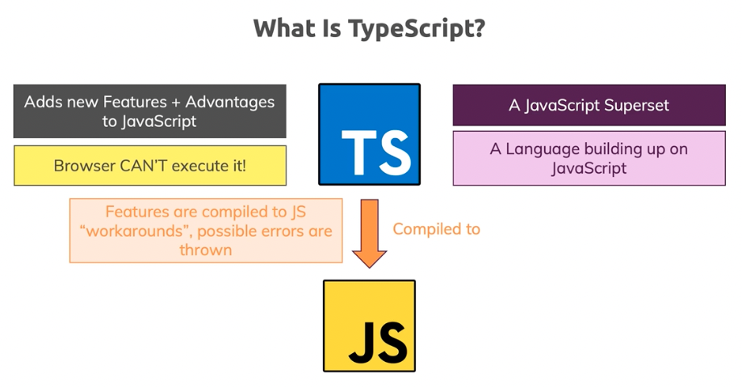

## Section 1: Getting Started
### About TypeScript
- TypeScript is Javascript Superset
- TypeScript is programing language building up on JavaScript. Its no new language, but takes JavaScript and adds new features to JavaScript, making writing JS easier.
- Browsers and node JS cannot execute TS
- TS is tool, powerful compiler which we run over our code to compile TS to JS code
- TS will be nicer eaiser to write, which will be converted into complex JS.
- TS add types, extra error checking, during development.





```js
function add(num1, num2) {
    return num1 + num2;
}

console.log(add('2', '3'));
```


- By default when we access value of input it will always be string
```js
// first-project/js-only.js
// example: access value of input is string
// TypeScript can be helpful
```
### Installing and Using TypeScript

- Go to https://www.typescriptlang.org/download/
- via npm - TypeScript is available as a package on the npm registry available as "typescript".
    - npm install typescript --save-dev
    - to invoke: tsc command
- via VSCode - 
- TS forces us to write better, cleaner and less lines of code

```js
// adjusted-project/using-js.js
// tsc using-tc.ts
npx tsc using-ts.ts
```

### TypeScript Advantages - Overview


### Course Outline


|JavaScript | Engines|
|-----|----|
|Firefox| SpiderMonkey|
|Chrome| v8|

- In 2009, opensource Javascript Engine in chome and embeded into C/C++  program and called Node.
Node is C/C++ program, includes googles v8 engine
- Javascript can run on Browser or in Node, both provide runtime environment
- ECMAScripts are specification, which Javascript confirms to these specification
- Organization name ECMA, who take care of ECMA Scripts, also called ES6
